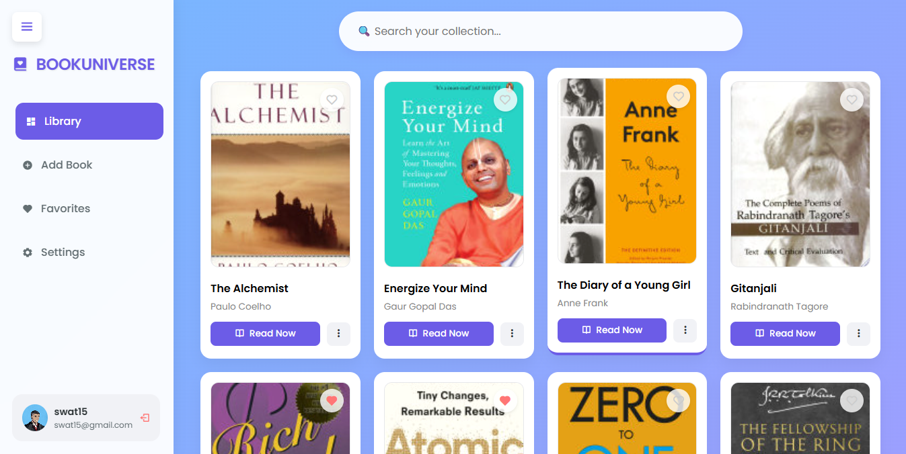

# 📚 BookUniverse

A modern, full-stack Book Management System powered by a robust **Backend API written in Golang**. This application demonstrates scalable RESTful architecture, integrating with MySQL and external services to create a seamless digital library experience wrapped in a beautiful Glassmorphism UI.

## Screenshot



## ✨ Key Features

- **⚡️ Go Backend API:** A high-performance REST API built with `Gorilla Mux` for routing and `GORM` for ORM-based data management.
- **🔍 Smart Auto-Fetch:** The frontend communicates with external APIs (Google Books) to automatically enrich your Go-served data with covers and reading links.
- **🎨 Modern UI:** Responsive Glassmorphism design with smooth CSS animations, interacting dynamically with the Go backend.
- **❤️ Favorites System:** Persists user preferences via API endpoints to the MySQL database.
- **👤 Authentication Logic:** Simulates secure user sessions (Signup/Login) with local storage persistence.
- **📱 Fully Responsive:** Mobile-friendly layout with a collapsible sidebar and touch-optimized controls.

## 🛠️ Tech Stack

**Backend (API Layer):**

- **Language:** Go (Golang)
- **Framework:** Gorilla Mux (Routing)
- **ORM:** GORM (Object Relational Mapping)
- **Database:** MySQL
- **Architecture:** MVC (Model-View-Controller) structure separating Routes, Controllers, and Models.

**Frontend (Client Layer):**

- HTML5, CSS3 (Custom Variables, Flexbox/Grid)
- Vanilla JavaScript (Fetch API for communicating with the Go API)
- Boxicons (Iconography)

## 🚀 Getting Started

### Prerequisites

- Go installed (v1.18+)
- MySQL installed and running

### Installation

1.  **Clone the repository**

    ```bash
    git clone [https://github.com/Swatantra-66/go-bookstore.git](https://github.com/Swatantra-66/go-bookstore.git)
    cd BookManagementAPI
    ```

2.  **Setup Database**
    Create a MySQL database named `simplerest` (or update the connection string in `pkg/config/app.go`).

3.  **Install Go Dependencies**

    ```bash
    go mod tidy
    ```

4.  **Run the Backend Server**

    ```bash
    go run cmd/main/main.go
    ```

5.  **Access the App**
    Open your browser and navigate to: `http://localhost:8000/`

## 📂 Project Structure

```text
go-bookstore/
├── cmd/
│   └── main/
│       └── main.go
├── pkg/
│   ├── config/
│   │   └── app.go
│   ├── handlers/
│   │   └── book_handlers.go
│   ├── models/
│   │   └── book.go
│   ├── routes/
│   │   └── routes.go
│   └── utils/
│       └── utils.go
├── static/
│   ├── index.html
│   └── default.png
├── go.mod
├── go.sum
├── .env
└── README.md
```

## 🤝 Contributing

Feel free to fork this project and submit pull requests.
